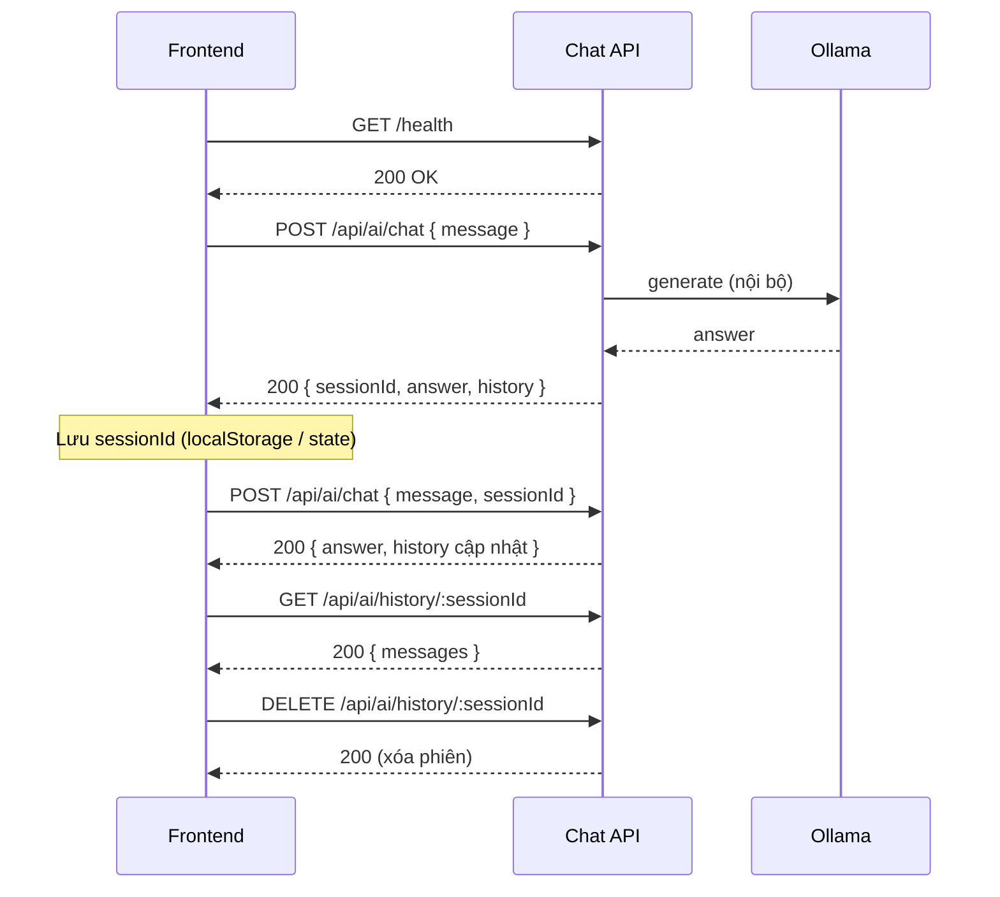

# Tài liệu tích hợp API — Frontend

Tài liệu dành cho team **Frontend** nối ứng dụng chat với **CNXH Chapter 6 Chat API**.

| Mục | Giá trị |
|-----|---------|
| Phiên bản API | `1.0.0` |
| Base path AI | `/api/ai` |
| Định dạng | `application/json` |
| Xác thực | **Không** (public nội bộ / demo) |
| CORS | **Bật** (`Access-Control-Allow-Origin: *`) |

---

## 1. Base URL theo môi trường

| Môi trường | Base URL | Ghi chú |
|------------|----------|---------|
| Local (dev BE) | `http://localhost:5000` | BE chạy `bun run dev` hoặc Docker map port 5000 |
| Docker trên máy chủ | `http://<IP-máy-chủ>:5000` | Cùng WiFi — xem README mục LAN |
| Ngrok (demo từ xa) | `https://xxxx.ngrok-free.dev` | URL đổi mỗi lần chạy ngrok |

**Swagger UI (test tay):** `{BASE_URL}/api-docs`  
**OpenAPI JSON:** `{BASE_URL}/api-docs.json`

### Ngrok (free tier)

Trình duyệt có thể hiện trang cảnh báo. Khi gọi API bằng `fetch` / axios, thêm header:

```http
ngrok-skip-browser-warning: true
```

---

## 2. Luồng tích hợp FE (khuyến nghị)



**Quy tắc `sessionId`:**

1. Lần chat **đầu**: không gửi `sessionId` → API trả `sessionId` mới → **FE lưu lại**.
2. Các lần sau: gửi cùng `sessionId` để bot nhớ ngữ cảnh (tối đa **10 tin** gần nhất trong prompt).
3. Nếu gửi `sessionId` **không tồn tại** trên server → API **tạo phiên mới** (UUID mới), không báo lỗi.
4. Muốn “chat mới”: xóa `sessionId` ở FE hoặc gọi `DELETE /history/:sessionId`.

---

## 3. Endpoints

### 3.1. `GET /health`

Kiểm tra BE sống trước khi bật UI chat.

**Response `200`**

```json
{
  "success": true,
  "message": "API is running"
}
```

---

### 3.2. `GET /`

Thông tin API và danh sách endpoint (tùy chọn).

**Response `200`**

```json
{
  "success": true,
  "name": "CNXH Chapter 6 Chat API",
  "message": "Chatbot hỏi đáp Chương 6 - Vấn đề dân tộc và tôn giáo",
  "docs": "GET /api-docs",
  "endpoints": {
    "health": "GET /health",
    "chat": "POST /api/ai/chat",
    "history": "GET /api/ai/history/:sessionId",
    "deleteHistory": "DELETE /api/ai/history/:sessionId"
  }
}
```

---

### 3.3. `POST /api/ai/chat` — Gửi tin nhắn

Endpoint chính FE cần gọi.

**Request body**

| Field | Kiểu | Bắt buộc | Mô tả |
|-------|------|----------|--------|
| `message` | `string` | Có | Câu hỏi người dùng (không rỗng sau khi trim) |
| `sessionId` | `string` (UUID) | Không | ID phiên; bỏ trống = phiên mới |

**Ví dụ — tin nhắn đầu**

```json
{
  "message": "Giải thích vấn đề dân tộc trong CNXH khoa học"
}
```

**Ví dụ — tiếp tục hội thoại**

```json
{
  "message": "Cho ví dụ ở Việt Nam",
  "sessionId": "a1b2c3d4-e5f6-7890-abcd-ef1234567890"
}
```

**Response `200` — thành công**

```json
{
  "success": true,
  "sessionId": "a1b2c3d4-e5f6-7890-abcd-ef1234567890",
  "answer": "Vấn đề dân tộc trong chủ nghĩa xã hội khoa học là...",
  "history": [
    {
      "role": "user",
      "content": "Giải thích vấn đề dân tộc trong CNXH khoa học",
      "createdAt": "2026-06-01T12:00:00.000Z"
    },
    {
      "role": "assistant",
      "content": "Vấn đề dân tộc trong chủ nghĩa xã hội khoa học là...",
      "createdAt": "2026-06-01T12:00:25.000Z"
    }
  ]
}
```

| Field response | Mô tả |
|----------------|--------|
| `sessionId` | Luôn trả về — FE lưu để gửi lại lần sau |
| `answer` | Câu trả lời mới nhất của bot (chỉ lượt này) |
| `history` | Toàn bộ tin trong phiên sau khi lưu (user + assistant) |

**Lỗi**

| HTTP | `message` (ví dụ) | FE xử lý |
|------|-------------------|----------|
| `400` | `Message is required` | Validate input trước khi gửi |
| `503` | `Cannot connect to Ollama...` | Hiện “AI đang bận / chưa sẵn sàng”, gợi ý thử lại |
| `500` | `Internal server error` | Hiện lỗi chung, log phía FE |

**Thời gian phản hồi:** Thường **15–60 giây** (CPU, lần đầu load model có thể lâu hơn). FE nên:

- Hiển thị loading / “Đang suy nghĩ…”
- `timeout` request ≥ **120000 ms** (2 phút)

---

### 3.4. `GET /api/ai/history/:sessionId`

Lấy lại toàn bộ hội thoại (refresh trang, mở lại tab).

**Path param:** `sessionId` — UUID đã lưu.

**Response `200`**

```json
{
  "success": true,
  "sessionId": "a1b2c3d4-e5f6-7890-abcd-ef1234567890",
  "messages": [
    {
      "role": "user",
      "content": "...",
      "createdAt": "2026-06-01T12:00:00.000Z"
    },
    {
      "role": "assistant",
      "content": "...",
      "createdAt": "2026-06-01T12:00:25.000Z"
    }
  ]
}
```

**Response `404`**

```json
{
  "success": false,
  "message": "Session not found"
}
```

→ FE coi như phiên hết hạn: xóa `sessionId` local, bắt đầu chat mới.

---

### 3.5. `DELETE /api/ai/history/:sessionId`

Xóa phiên trên server (“Xóa lịch sử” / “Chat mới”).

**Response `200`**

```json
{
  "success": true,
  "message": "Chat history deleted successfully"
}
```

**Response `404`:** `Session not found` — có thể bỏ qua, vẫn xóa state phía FE.

---

## 4. TypeScript (copy sang FE)

```typescript
export type MessageRole = "user" | "assistant";

export interface ChatMessage {
  role: MessageRole;
  content: string;
  createdAt: string; // ISO 8601
}

export interface ChatRequest {
  message: string;
  sessionId?: string;
}

export interface ChatSuccessResponse {
  success: true;
  sessionId: string;
  answer: string;
  history: ChatMessage[];
}

export interface HistorySuccessResponse {
  success: true;
  sessionId: string;
  messages: ChatMessage[];
}

export interface ApiErrorResponse {
  success: false;
  message: string;
}

export type ApiResponse<T> = T | ApiErrorResponse;
```

---

## 5. Ví dụ gọi API

### 5.1. `fetch` (JavaScript / React)

```typescript
const API_BASE = import.meta.env.VITE_API_URL ?? "http://localhost:5000";

const defaultHeaders: HeadersInit = {
  "Content-Type": "application/json",
  ...(API_BASE.includes("ngrok") && {
    "ngrok-skip-browser-warning": "true",
  }),
};

export async function sendChat(message: string, sessionId?: string) {
  const res = await fetch(`${API_BASE}/api/ai/chat`, {
    method: "POST",
    headers: defaultHeaders,
    body: JSON.stringify({ message, sessionId }),
    signal: AbortSignal.timeout(120_000),
  });

  const data = await res.json();

  if (!res.ok || !data.success) {
    throw new Error(data.message ?? `HTTP ${res.status}`);
  }

  return data as ChatSuccessResponse;
}

export async function getHistory(sessionId: string) {
  const res = await fetch(`${API_BASE}/api/ai/history/${sessionId}`, {
    headers: defaultHeaders,
  });
  const data = await res.json();
  if (!res.ok || !data.success) throw new Error(data.message);
  return data as HistorySuccessResponse;
}

export async function checkHealth(): Promise<boolean> {
  try {
    const res = await fetch(`${API_BASE}/health`, { headers: defaultHeaders });
    const data = await res.json();
    return res.ok && data.success === true;
  } catch {
    return false;
  }
}
```

### 5.2. axios

```typescript
import axios from "axios";

const api = axios.create({
  baseURL: import.meta.env.VITE_API_URL ?? "http://localhost:5000",
  timeout: 120_000,
  headers: { "Content-Type": "application/json" },
});

// Ngrok: thêm interceptor nếu cần
api.interceptors.request.use((config) => {
  if (config.baseURL?.includes("ngrok")) {
    config.headers["ngrok-skip-browser-warning"] = "true";
  }
  return config;
});

export const chatApi = {
  health: () => api.get("/health"),
  sendMessage: (message: string, sessionId?: string) =>
    api.post<ChatSuccessResponse>("/api/ai/chat", { message, sessionId }),
  getHistory: (sessionId: string) =>
    api.get<HistorySuccessResponse>(`/api/ai/history/${sessionId}`),
  deleteHistory: (sessionId: string) =>
    api.delete(`/api/ai/history/${sessionId}`),
};
```

### 5.3. Biến môi trường FE (`.env`)

```env
# Vite
VITE_API_URL=http://localhost:5000

# Ngrok demo
# VITE_API_URL=https://xxxx.ngrok-free.dev
```

---

## 6. Gợi ý UI/UX

| Tình huống | Gợi ý |
|------------|--------|
| Gửi câu hỏi | Disable nút Gửi + spinner cho đến khi có `answer` |
| `503` | “Hệ thống AI chưa sẵn sàng. Liên hệ người vận hành hoặc thử lại sau.” |
| `400` | Highlight ô nhập: “Vui lòng nhập câu hỏi” |
| F5 / mở lại app | Đọc `sessionId` từ `localStorage` → `GET /history/:id` → render `messages` |
| Nút “Chat mới” | `DELETE /history/:id` (nếu có) + xóa storage + clear state |
| Hiển thị tin | `role === "user"` → bubble phải; `assistant` → bubble trái |
| Thời gian | Dùng `createdAt` format `vi-VN` nếu cần |

---

## 7. Giới hạn & hành vi cần biết

| Mục | Chi tiết |
|-----|----------|
| Ngữ cảnh bot | Chỉ dựa dataset **Chương 6**; câu **ngoài bài học** → trả lời ngắn cố định, không gọi Ollama (nhanh hơn) |
| Ngoài phạm vi | `answer`: *"Câu hỏi này ngoài phạm vi Chương 6 (Vấn đề dân tộc và tôn giáo) — chương trình môn CNXH khoa học. Tôi không trả lời được nội dung ngoài bài học."* |
| Lịch sử gửi cho AI | Tối đa **10 tin** gần nhất mỗi phiên (5 lượt hỏi–đáp) |
| Lưu trữ | Server lưu file JSON, **không** đồng bộ đa thiết bị tự động |
| Streaming | **Không** hỗ trợ SSE/WebSocket — một request trả một `answer` đầy đủ |
| Upload file / ảnh | **Không** hỗ trợ |

---

## 8. Checklist trước khi ghép FE

- [ ] `GET /health` OK từ máy chạy FE (hoặc trình duyệt)
- [ ] `VITE_API_URL` trỏ đúng IP/ngrok
- [ ] CORS: gọi từ origin FE không bị chặn (API đã `cors()` mở)
- [ ] Timeout chat ≥ 120s
- [ ] Lưu `sessionId` sau lần `POST /chat` đầu
- [ ] Test `POST /chat` có `sessionId` — câu trả lời có nhắc ngữ cảnh trước

---

## 9. Liên hệ / tài liệu thêm

| Tài liệu | Đường dẫn |
|----------|-----------|
| README vận hành BE | [../README.md](../README.md) |
| Swagger (thử API) | `{BASE_URL}/api-docs` |
| OpenAPI JSON | `{BASE_URL}/api-docs.json` |
| Repo GitHub | https://github.com/soloplayer345/cnxh-chapter6-chat-api |

Nếu đổi contract API, cập nhật file này và version trong `package.json` / Swagger.
